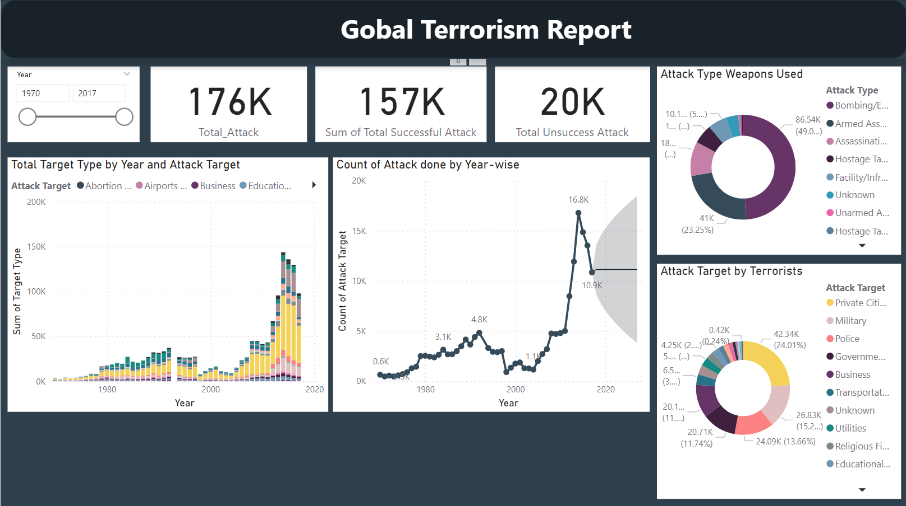
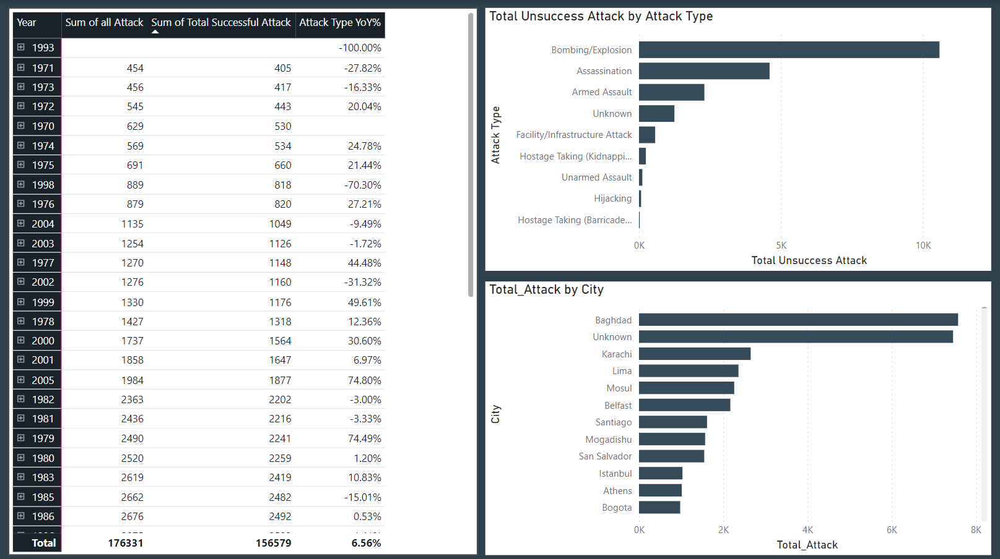
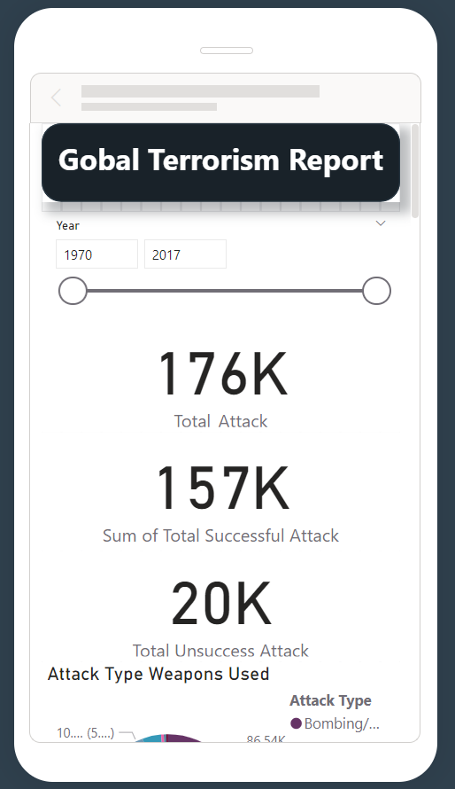
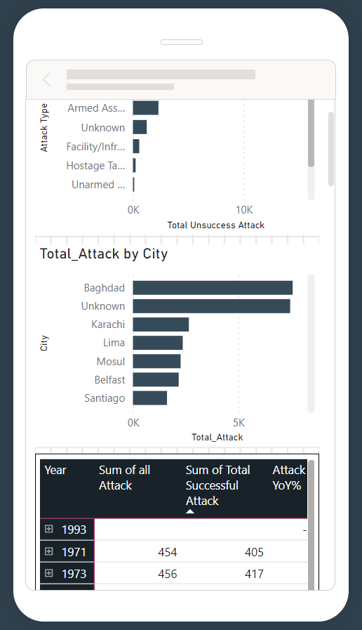

# Global Terrorism PowerBI

Analyse the global terrorism datasets and create understandable insight.

## Microsoft Power BI Desktop

- Microsoft Power BI Desktop is built for the analyst. It combines state-of-the-art interactive visualizations, with industry-leading data query and modeling built-in. 
- Create and publish your reports to Power BI. Power BI Desktop helps you empower others with timely critical insights, anytime, anywhere.

Download Microsoft Power BI Desktop from here -> [Link](https://www.microsoft.com/en-us/download/details.aspx?id=58494)

## Interactive Visual

### Desktop View

### Mobile View

